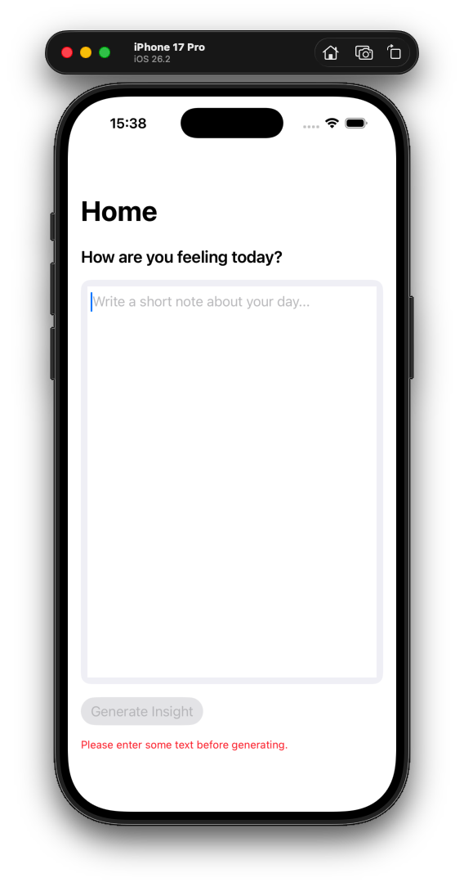
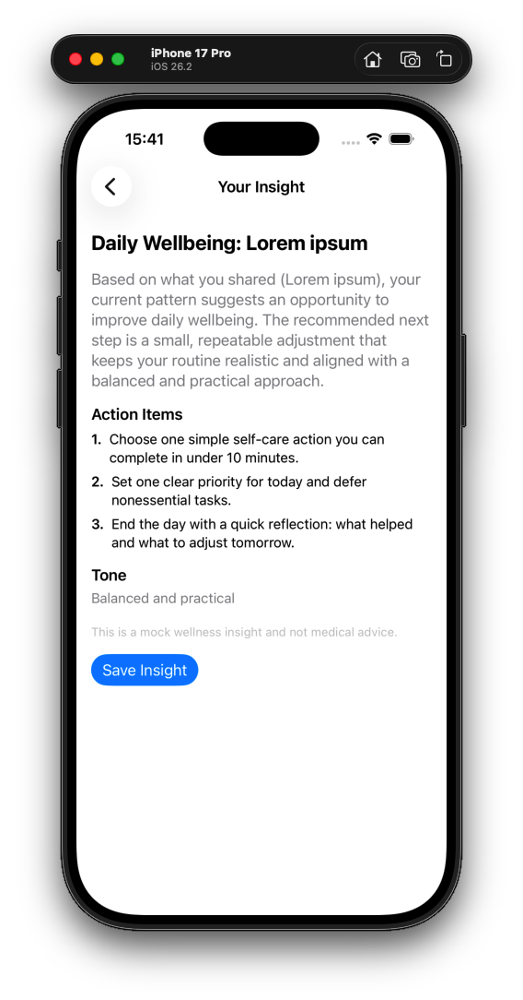
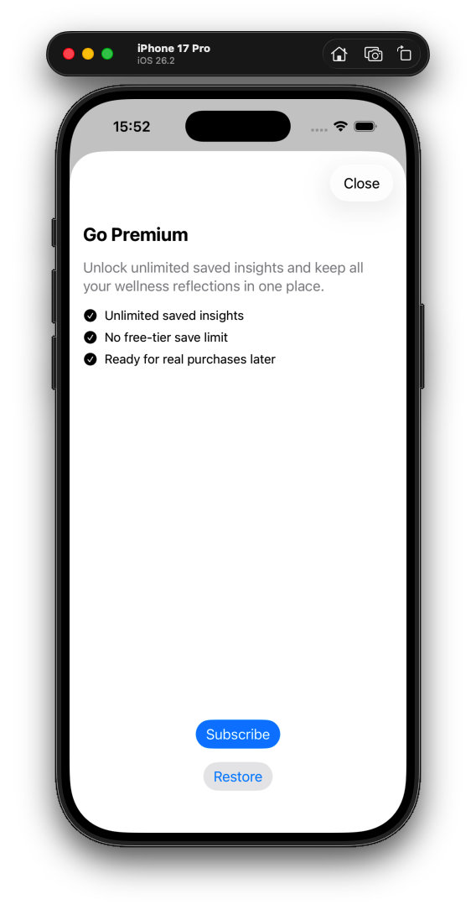

# SwiftUI AI Subscription Starter

A production-style SwiftUI starter project for building **AI-powered subscription apps on iOS**.

This repository demonstrates how a real mobile product might work: onboarding, AI-generated insights, premium feature gating, and a paywall — all structured through clean, testable architecture.

The project intentionally uses **mock services** so teams can prototype product behavior quickly without needing backend infrastructure or third-party SDKs.

This makes it ideal for exploring product ideas, building MVPs, or starting new AI-powered apps.

---

# Demo Flow

User journey implemented in the app:

Splash → Onboarding → Home → Generate Insight → Insight Result → Save Insight → Paywall

*(Add screenshots or GIF here)*

Example placeholders:

### Home Screen


### Insight Result


### Paywall


---

# Features

### Product Features

• Onboarding flow  
• AI-powered insight generation (mock service)  
• Structured AI responses  
• Insight saving flow  
• Free vs Premium feature gating  
• Paywall screen with subscription actions  

### Technical Features

• SwiftUI-based UI  
• Lightweight MVVM architecture  
• Protocol-driven services  
• Mock AI service for fast prototyping  
• Mock subscription service  
• Analytics abstraction layer  
• Local persistence for onboarding and insights  
• Unit tests for core business logic  

---

# Tech Stack

- SwiftUI
- Swift
- Lightweight MVVM
- Protocol-based services
- Dependency container pattern
- Mock AI service
- Mock subscription service
- Analytics abstraction
- Local persistence
- XCTest unit tests

No third-party dependencies are required to run the project.

---

# Architecture Overview

The project uses a **feature-based structure with protocol-driven services** to keep UI logic separated from business logic.

```
App/
Core/
  Models/
  Services/
  Networking/
  Storage/
  Analytics/
  DesignSystem/
Features/
  Onboarding/
  Home/
  Insight/
  Paywall/
  Settings/
Tests/
```

### Key design principles

• UI views remain lightweight  
• Business logic lives in services  
• Protocols allow easy swapping of implementations  
• Mock services enable product prototyping without infrastructure  

---

# Mock vs Production-Ready

The project uses **mock implementations intentionally** to allow rapid experimentation.

### Mock Components

• `MockAIService`  
• `MockSubscriptionService`  
• `MockAnalyticsService`

These simulate realistic product behavior while keeping the app fully runnable.

### Production Integrations (future)

The architecture allows replacing mocks with real services without rewriting UI code.

For example:

Replace:

```
MockAIService
```

with:

```
OpenAIService
ClaudeService
Custom backend AI endpoint
```

Replace:

```
MockSubscriptionService
```

with:

```
RevenueCat
StoreKit
```

Replace:

```
MockAnalyticsService
```

with:

```
PostHog
Firebase Analytics
Amplitude
```

---

# Example Use Cases

This starter can be adapted to build:

• AI coaching or wellness apps  
• AI productivity assistants  
• AI writing or summarization tools  
• AI-powered consumer apps  
• Subscription-based mobile products  

It provides a foundation for any app that combines **AI features with a subscription model**.

---

# Why this project exists

Many client projects start with the same challenge:

Teams want to test an AI-powered product idea quickly without committing to complex infrastructure.

This repository demonstrates how an early-stage iOS product can be structured so that:

• core product flows work from day one  
• architecture remains simple and testable  
• external services can be integrated later  
• teams can iterate on product ideas quickly  

It is designed to **accelerate the path from idea to MVP**.

---

# Running the Project

1. Clone the repository

```
git clone https://github.com/yourname/swiftui-ai-subscription-starter.git
```

2. Open the project in Xcode

3. Select an iOS simulator

4. Run the app

No API keys or external services are required.

---

# Extending the Starter

Developers can extend this project by replacing mock services with real integrations.

Examples:

### AI Integration

Replace:

```
MockAIService
```

with a real AI provider:

```
OpenAI API
Claude API
Local AI backend
```

---

### Subscriptions

Replace:

```
MockSubscriptionService
```

with:

```
RevenueCat
StoreKit 2
```

---

### Analytics

Replace:

```
MockAnalyticsService
```

with:

```
PostHog
Firebase
Amplitude
```

---

# Tests

The project includes unit tests for:

• onboarding persistence  
• premium feature gating  
• insight logic  

Tests ensure core product behavior remains stable while evolving the architecture.

---

# License

MIT
